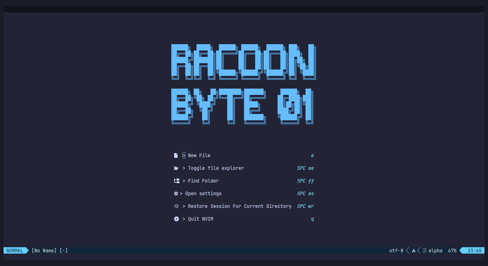
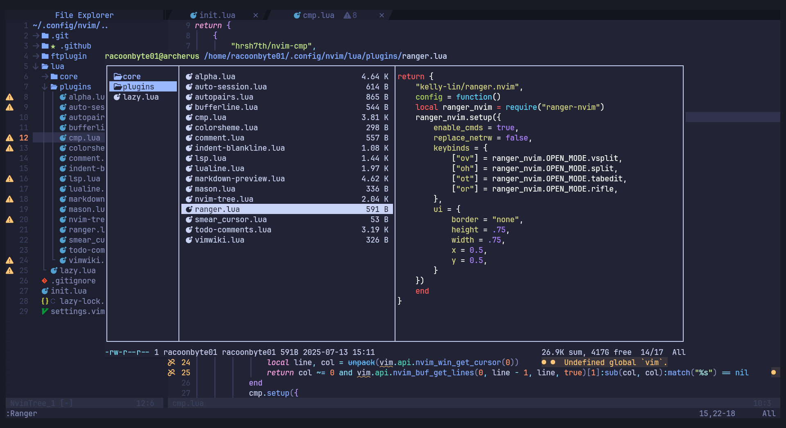
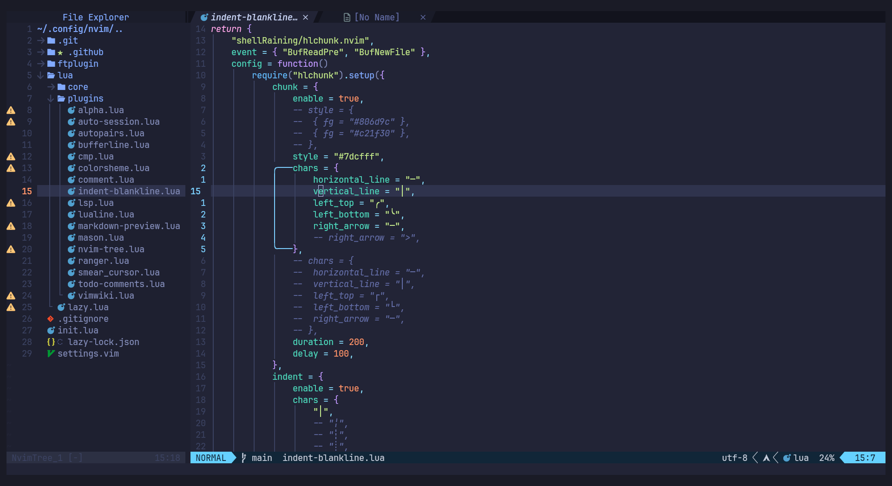
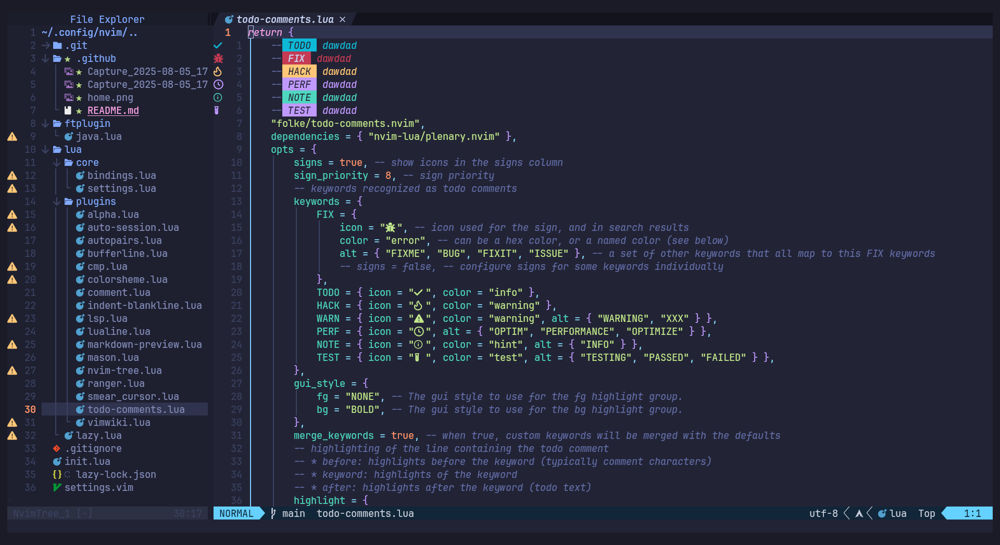

<h1 align="center">💻 NVIM Dotfiles 📓</h1>

These are my configuration files for nvim.

<h2>💤 Lazy <i>Plugin Manager</i></h2>

Uses <a href="https://github.com/folke/lazy.nvim"><b>lazy</b></a> as a plugin manager. So I invite you to read a little about this great project.

All plugins and their respective configurations are located in <a href="https://github.com/RacoonByte01/nvim-dotfiles/tree/main/lua">this folder</a>.

<ul>
	<li><a href="https://github.com/goolord/alpha-nvim">🏠 Alpha</a> <i>(Home page)</i></li>
	<li><a href="https://github.com/rmagatti/auto-session">🪪 Auto Session</a> <i>(Session manager)</i></li>
	<li><a href="https://github.com/windwp/nvim-autopairs">✍️ Auto Pairs</a> <i>(Automatically closes characters)</i></li>
	<li><a href="https://github.com/hrsh7th/nvim-cmp">🗃️ CMP</a> <i>(Auto completion engine)</i></li>
	<li><a href="https://github.com/folke/tokyonight.nvim">🎨 Tokyonight</a> <i>(Colorsheme)</i></li>
	<li><a href="https://github.com/numToStr/Comment.nvim">💬 Comment</a> <i>(Commenting)</i></li>
	<li><a href="https://github.com/shellRaining/hlchunk.nvim">❕ Hlchunk</a> <i>(Highlight the indent line)</i></li>
	<li><a href="https://github.com/neovim/nvim-lspconfig">📦 LSP</a> <i>(Language Server Protocol)</i></li>
	<li><a href="https://github.com/nvim-lualine/lualine.nvim">🪧 Lualine</a> <i>(Notification line below)</i></li>
	<li><a href="https://github.com/iamcco/markdown-preview.nvim">🖥 Markdown Preview</a> <i>(Preview in a browser)</i></li>
	<li><a href="https://github.com/mason-org/mason.nvim">📦 Mason</a> <i>(Portable package manager)</i></li>
	<li><a href="https://github.com/nvim-tree/nvim-tree.lua">🌳 Nvim Tree</a> <i>(File explorer)</i></li>
	<li><a href="https://github.com/kelly-lin/ranger.nvim">📂 Ranger</a> <i>(File manager)</i></li>
	<li><a href="https://github.com/sphamba/smear-cursor.nvim">👈 Smear Cursor</a> <i>(Animate the cursor)</i></li>
	<li><a href="https://github.com/folke/todo-comments.nvim">☑️ Todo Comments</a> <i>(Color and iconize comments)</i></li>
	<li><a href="https://github.com/vimwiki/vimwiki">🌍 Vimwiki</a> <i>(Personal wiki for Vim)</i></li>
</ul>

<h2>👀 Examples of how it looks</h2>

<table>
	<tbody>
		<tr>
			<td></td>
			<td></td>
		</tr>
		<tr>
			<td></td>
			<td></td>
		</tr>
	</tbody>
</table>
